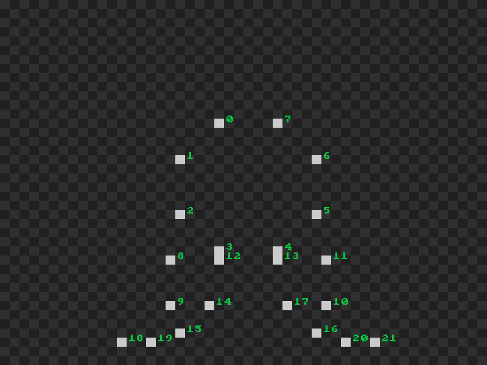
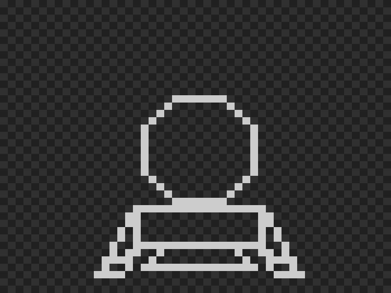
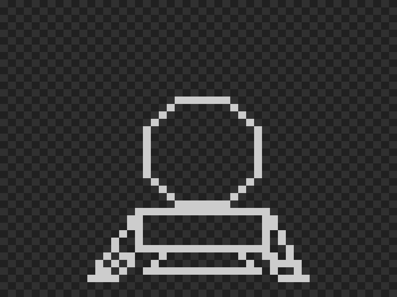
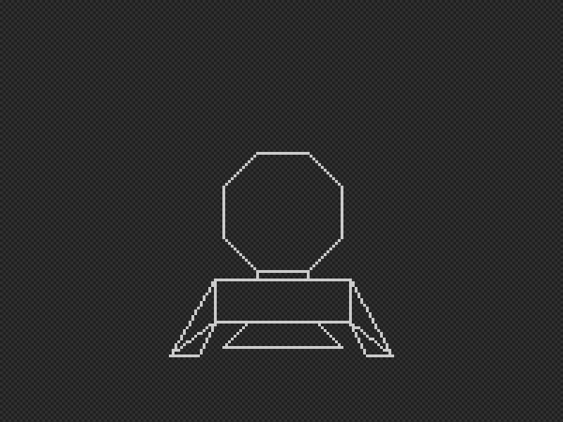
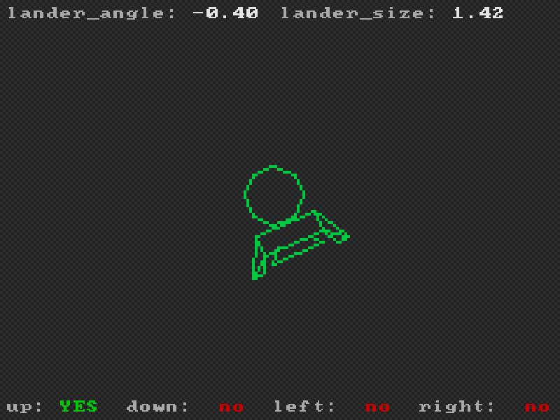

import Wikimedia from "@/components/Wikimedia.astro";

<Wikimedia 
  file="GT40_Lunar_Lander.jpg" 
  float="right" 
  imgClass="rounded shadow" 
/>

In 1972, the Digital Equipment Corporation released the DEC GT40, a vector graphics computer that feels like the kind of "oldish" cruncher you'd stumble across in games like Fallout or Alien: Isolation.

A year later, in 1973, Jack Burness was commissioned to create his own take on the "Lunar Lander" genre. The result was Moonlander.

While not the very first Lunar Lander game, Moonlander broke new ground in several ways. It was the first to be fully graphical—earlier versions had been purely text-based. It may also have been the first game to ever show a human character on screen: when players successfully landed, a tiny astronaut would appear on the lunar surface.
Finally, the game is known to probably be the very first game to have an easter egg.
It was possible to find a MacDonald's restaurant on the Moon, and even order a cheeseburger, or crash on it.

The game became a genre on its own, and after [nearly 60 years of Lunar Lander](https://technologizer.com/2009/07/19/lunar-lander/index.html), I made my own version:

import BanjoGame from "@/components/BanjoGame.jsx";

<BanjoGame client:load game="moonlander">
Press 'H' for commands.
</BanjoGame>

Compared to the previous game I made [Pong](/posts/1972-pong), this one is a huge bump and has a lots of "first" for this project.

## Drawing the Lander

We want a wireframe-style lander, to preserve the feeling of the old games.
And while we could do draw a sprite on the screen and scale/rotate it to having it our way, this does seem like an overkill solution for something as simple as drawing lines.

So, let's start from there, and assume the only thing we have for now is a "draw line" function, which could be used that way:

```c
void draw_line(x0, y0, x1, y1);
```

This simply traces a segment from _x0;y0_ to _x1;y1_ on the screen.
The implementation of such function is out of the scope of this post, but if you are interested, you can take a loot at [my primitives drawing functions](https://github.com/OragonEfreet/banjo/blob/main/src/bitmap_draw.c).

This function is enough to draw anything wireframey, given we feed it with the correct data.
So let's define a set of points in 2D space:

```c
#define LANDER_VERTICES_LEN 22

const float lander_coords[LANDER_VERTICES_LEN][2] = {
    {-3, -7}, {-7, -3}, {-7, 3}, {-3, 7},   {3, 7},
    {7, 3},   {7, -3},  {3, -7}, {-8, 8},   {-8, 13},
    {8, 13},  {8, 8},   {-3, 8}, {3, 8},    {-4, 13},
    {-7, 16}, {7, 16},  {4, 13}, {-13, 17}, {-10, 17},
    {10, 17}, {13, 17},
};
```

Alone, these are just pixel positions, without shaping anything yet.
The pixel at index _0_ is _x = -3, y = -7_ and so on.
Displaying all pixels of this array on a canvas would render this:



Instead, let's connect the dots!
We now add a second array, that lists the lines that our lander is made of:

```c
#define LANDER_EDGES_LEN 25

const size_t lander_edges[LANDER_EDGES_LEN][2] = {
    // Head
    {0, 1}, {1, 2}, {2, 3}, {3, 4}, {4, 5}, {5, 6}, {6, 7}, {7, 0}, 
    //Base
    {8, 9}, {9, 10}, {10, 11}, {11, 8},  
    // Neck
    {3, 12}, {4, 13},
    // Left Leg
    {8, 18}, {18, 19}, {9, 19}, {9, 18},  
    // Right Leg
    {11, 21}, {20, 21}, {10, 20}, {10, 21}, 
    // Thrusters
    {14, 15}, {15, 16}, {16, 17},
};
```

Each pair in `lander_edges` describes a segment to draw, expressed in indices of `lander_coords`.
Thus, if we want for example to draw the 3rd line (index _2_ in `lander_edges`), we do:

```c
draw_line(
    lander_coords[lander_edges[2][0]][0], // Line 2, Coord 0, Axis 0 (X)
    lander_coords[lander_edges[2][0]][1], // Line 2, Coord 0, Axis 1 (Y)
    lander_coords[lander_edges[2][1]][0], // Line 2, Coord 0, Axis 0 (X)
    lander_coords[lander_edges[2][1]][1]  // Line 2, Coord 0, Axis 1 (Y)
);
```

Ok.
Combining this all in a loop through `lander_edges` is quite simple.
In the following code, I also shift all the coordinates by `x` and `y`, in order to center the drawing on the canvas:

```c
int x = CANVAS_W / 2;
int y = CANVAS_H / 2;

for (size_t e = 0; e < LANDER_EDGES_LEN; ++e) {
    const float x0 = lander_coords[lander_edges[e][0]][0];
    const float y0 = lander_coords[lander_edges[e][0]][1];
    const float x1 = lander_coords[lander_edges[e][1]][0];
    const float y1 = lander_coords[lander_edges[e][1]][1];

    draw_line(x + x0, y + y0, x + x1, y + y1);
}
```

And here's our lander, displayed on a 50x40 pixel grid:



Now, this is good, but rather inconvenient.
Most of the time, the ship is rotating from the player's inputs.
The displacement of the ship entirely depends on its angle rather than being aligned to X or Y.
It feels simpler to use [polar coordinates](https://en.wikipedia.org/wiki/Polar_coordinate_system) instead.

While cartesian coordinates are used to express a position using a vector along each axis (X and Y), polar coordinates store two other information:
how far the position is from the origin (the radius) and the angle the x/y vector makes from the X (or Y) axis.

:::important
Add program showing trigonometry
:::

So, first, let's go back to the initial coordinates.
But now, I'm also providing a new array of two floats.
Each element of this new array is a _[ρ, θ]_ pair, where _ρ_ is the distance from origin, and _θ_ is the angle between the X/Y vector, and the X axis.

We can quickly compute from cartesian to polar coordinates with $ρ = \sqrt{x^2+y^2}$ and $\theta = \operatorname{atan2}(y,x)$.

```c
const int lander_xy_coords[][2] = {
    // ... unchanged
};

float lander_coords[LANDER_VERTICES_LEN][2]; // Now polar coordinates

for(size_t c = 0 ; c < LANDER_VERTICES_LEN ; ++c) {
    const float x = lander_xy_coords[c][0];
    const float y = lander_xy_coords[c][1];

    lander_coords[c][0] = sqrt(x * x + y * y);
    lander_coords[c][1] = atan2f(y, x);
}
```

The drawing part can now be updated to read the polar coordinates and convert them back to cartesian before calling `draw_line`.
Converting back to Cartesian gives $x = r \cos\theta$ and $y = r \sin\theta$:

```c
int x = CANVAS_W / 2;
int y = CANVAS_H / 2;

float lander_angle = 0.f;
float lander_size = 1.f;

for (size_t e = 0; e < LANDER_VERTICES_LEN; ++e) {
    const float r0 = lander_coords[lander_edges[e][0]].radius * lander_size;
    const float a0 = lander_coords[lander_edges[e][0]].angle  + lander_angle;
    const float r1 = lander_coords[lander_edges[e][1]].radius * lander_size;
    const float a1 = lander_coords[lander_edges[e][1]].angle  + lander_angle;

    const float x0 = cosf(a0) * r0;
    const float y0 = sinf(a0) * r0;
    const float x1 = cosf(a1) * r1;
    const float y1 = sinf(a1) * r1;

    draw_line(x + x0, y + y0, x + x1, y + y1);
}
```



Ok, the display is a bit weird.
The legs seem different compared to the previous draw.
This is due to how low the resolution is and rounding/truncating floats.
If we increate the game resolution, let's say 200/150, we get a better result:



We may wonder why bother converting back and forth between polar and X/Y coordinates.
But now, manipulating the ship is really easy.
In the above snippet, I provide `lander_angle` and `lander_size`.
The former modifies the angle for all coordinates, and the latter changes the radius.

Now, after a small edit on the initial coordinates to lower the center of the ship, and added some green color, we have our ship.
We can play with `lander_angle` and `lander_size` to rotate and scale the lander:



