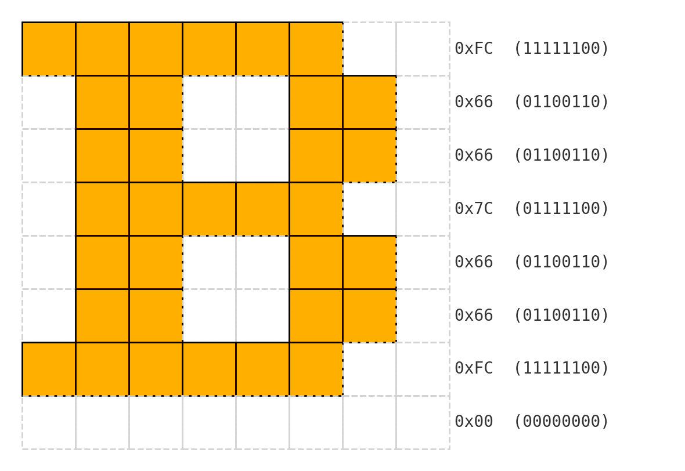
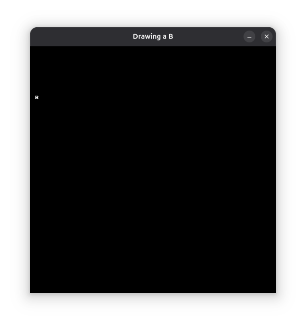
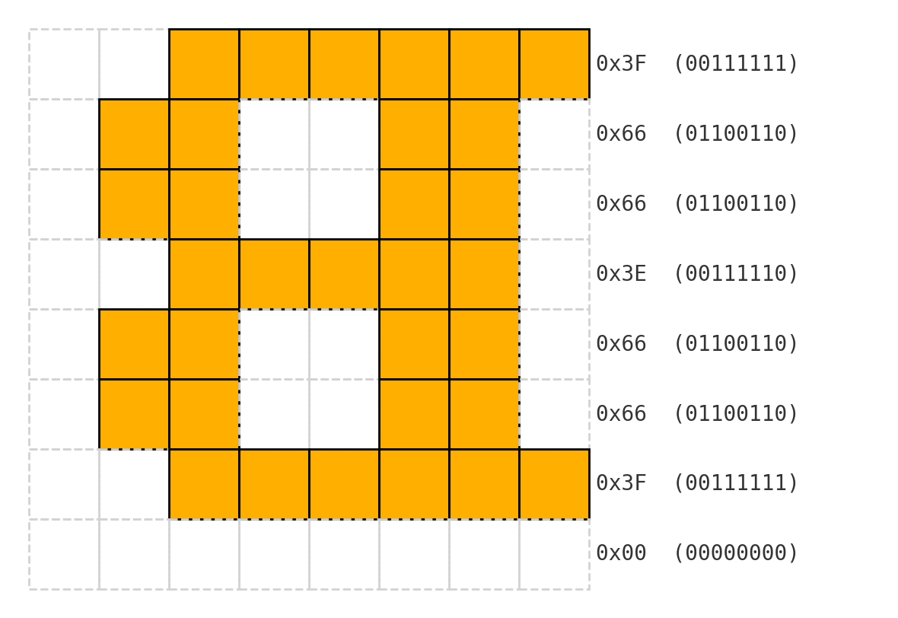
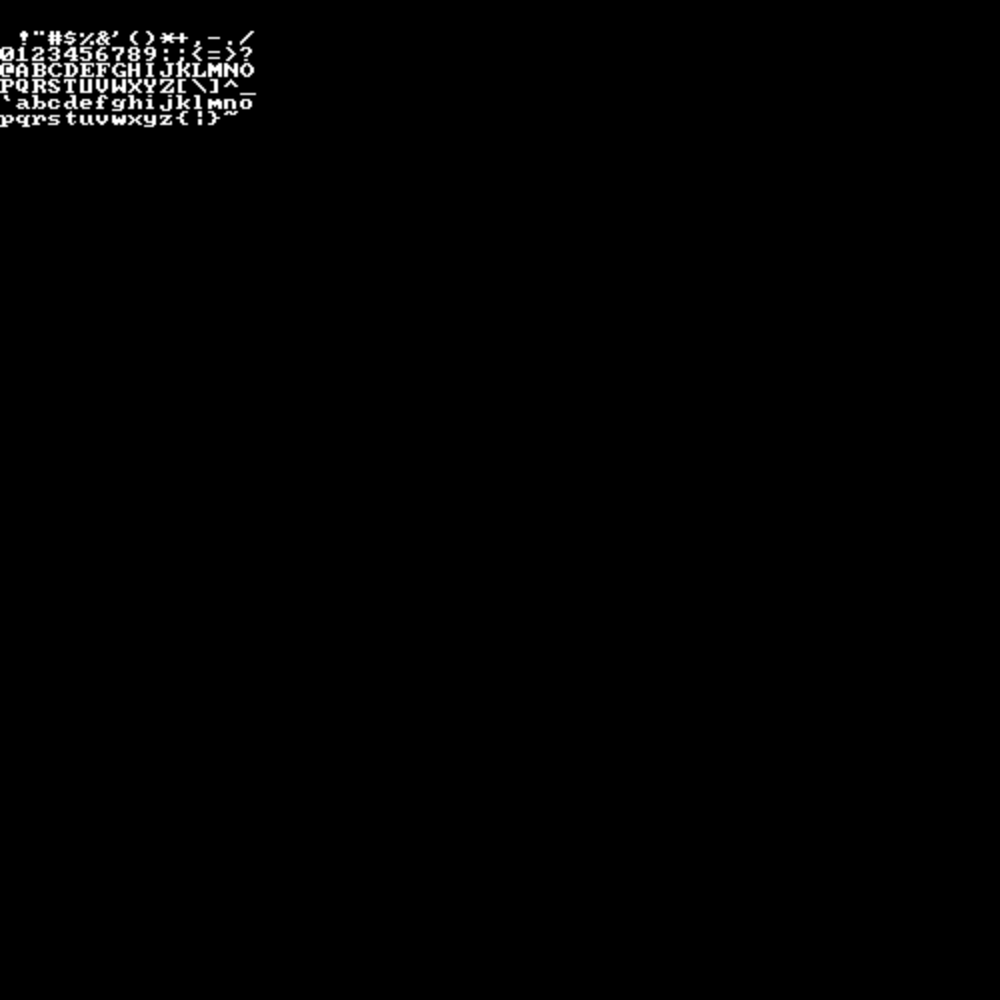
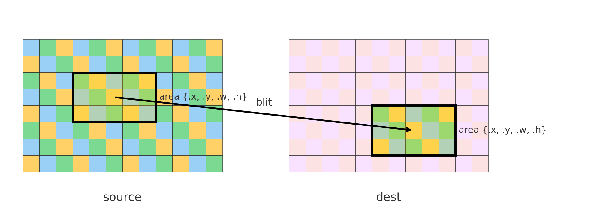
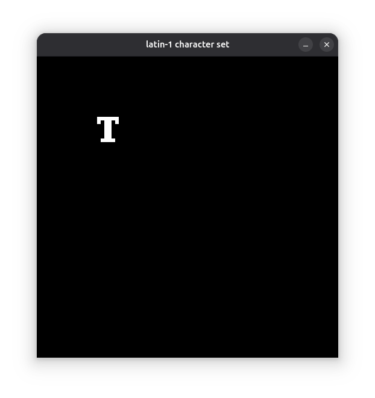
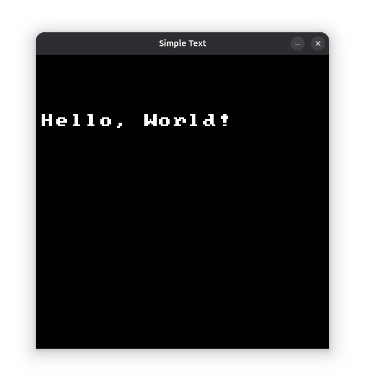

Making [Pong](/posts/1972-pong) did not require a lot of text handling.
I encoded digits from 0 to 9 into arrays of bits, each bit telling if a pixel needs to be set or not.
In fact, the game does not expect more than 2-digit numbers.
Which is why I capped the game score to 15.

Now that I'm [moving forward to 1973 with a new game](/posts/retro-game-dev), I need a slightly more advanced system:

- Be able to write full ASCII
- Position and scale the text wherever I want
- C-style string formatting (with "%d" and all)

Thus, I worked on a very basic text blitting API that consists of building an 8x8 font ahead of time and blitting it when drawing text onto the screen.

## Theory

### The 'B' Example

The first thing I need is designing an 8x8 bitmap font.

8x8 is pretty convenient because it means that each character can be nicely represented by eight 8-bit integers.
If we take for example the 'B' character, the rows, from top to bottom, can be encoded this way:



As such, the 'B' can be:

```c
char B[] = {
    0xFC, // 1st (top-most) row
    0x66, // 2nd row
    0x66, // ...
    0x7C,
    0x66,
    0x66,
    0xFC,
    0x00, // last (bottom) row
};
```

To tell if we draw the pixel at `column`/`row` for character `B`, we perform a bit shift at index `row` of `B`.
Putting this all together, drawing a 'B' will correspond to this code:

```c
// Draw B on 'bitmap' at 'x'/'y'
for(size_t row = 0 ; row < 8 ; ++row) {
    for(size_t column = 0 ; column < 8 ; ++column) {
        if((B[row] >> (7 - column)) & 0x01) {
            write_pixel(bitmap, x + column, y + row, white);
        }
    }
}
```

This draws an unscaled 8x8 pixel character at the given position (`x`/`y`):



### Simpler Column Access

Now, this could be simplified, by horizontally flipping the encoded character.
This way, the bit shift is directly taken from the column:



```c
char B[] = { 0x3F, 0x66, 0x66, 0x3E, 0x66, 0x66, 0x3F, 0x00, };

for(size_t row = 0 ; row < 8 ; ++row) {
    for(size_t column = 0 ; column < 8 ; ++column) {
        if((B[row] >> column) & 0x01) { // This line is simpler
            write_pixel(bitmap, x + column, y + row, white);
        }
    }
}
```

And of course, we don't want to write a single char, but an entire text.

## Building a Font Atlas

### Loading a Prebuilt Charset

First, we will stick to the usual Latin-1 characters and make an entire array of letters (horizontally flipped).
Fortunately, [someone already did it](https://github.com/dhepper/font8x8), which was a time saver for me:

```c
#define CHAR_PIXEL_H 8
#define CHAR_PIXEL_W 8 // Used later

static char charset_latin1[][CHAR_PIXEL_H] = {
    { 0x00, 0x00, 0x00, 0x00, 0x00, 0x00, 0x00, 0x00},   // U+0000 (nul)
    // ...
    { 0x0C, 0x1E, 0x33, 0x33, 0x3F, 0x33, 0x33, 0x00},   // U+0041 (A)
    { 0x3F, 0x66, 0x66, 0x3E, 0x66, 0x66, 0x3F, 0x00},   // U+0042 (B)
    { 0x3C, 0x66, 0x03, 0x03, 0x03, 0x66, 0x3C, 0x00},   // U+0043 (C)
    { 0x1F, 0x36, 0x66, 0x66, 0x66, 0x36, 0x1F, 0x00},   // U+0044 (D)
    // ...
};
```

This table covers all letters from [Basic Latin](https://en.wikipedia.org/wiki/List_of_Unicode_characters#Basic_Latin), the first Unicode block.
This will be a good start for simple text rendering.
Most importantly, this also means that I can directly take the `char` ASCII values from a C-style string and use them as indexes for my array (`charset_latin1['B']`).

### A Bitmap of Glyphs

Now, let's make a dedicated bitmap to contain all the characters of this table.
First, we decide the dimensions of our character bitmap.
It will be an NxM grid, each cell containing the glyph for a character.
I arbitrarily decided that the bitmap will contain rows of 16 characters.
The number of rows will depend on the total number of characters to support.
In the case of the `charset_latin1` page above, it's 128 characters.
But I will make this a runtime variable to later support other character pages.

Eventually, we get enough data to create a bitmap to hold our charset:

```c
#define CHARSET_CHAR_PER_ROW 16

const size_t charset_char_len     = sizeof charset_latin1 / sizeof charset_latin1[0];
const size_t charset_char_per_col = 
    charset_char_len / CHARSET_CHAR_PER_ROW 
    + (charset_char_len % CHARSET_CHAR_PER_ROW > 0);

const size_t charset_pixel_width  = CHARSET_CHAR_PER_ROW * CHAR_PIXEL_W;
const size_t charset_pixel_height = charset_char_per_col * CHAR_PIXEL_H;

bitmap charset = create_bitmap(charset_pixel_width, charset_pixel_height);
```

We also need macros to get the coordinates of a character in the charset:

```c
#define CHAR_PIXEL_X(c) ((c % CHARSET_CHAR_PER_ROW) * CHAR_PIXEL_W)
#define CHAR_PIXEL_Y(c) ((c / CHARSET_CHAR_PER_ROW) * CHAR_PIXEL_H)
```

Then we fill the bitmap:

```c
for(size_t c = 0 ; c < charset_char_len ; ++c) {
    const size_t x = CHAR_PIXEL_X(c);
    const size_t y = CHAR_PIXEL_Y(c);

    for(size_t row = 0 ; row < CHAR_PIXEL_H ; ++row) {
        for(size_t column = 0 ; column < CHAR_PIXEL_W ; ++column) {
            if((charset_latin1[c][row] >> column) & 0x01) {
                write_pixel(charset, x + column, y + row, white);
            }
        }
    }
}
```

And here’s the result:



---

## Rendering Text

### Blitting One Character

Displaying text on a bitmap will require something called *blitting*.
Blitting is about taking a portion of a bitmap and copying it into another bitmap.
It’s behind most pure 2D sprite-based games.



We’ll use this small API:

```c
typedef struct {
    int x;
    int y;
    unsigned int w;
    unsigned int h;
} area;

blit_bitmap(
    const bitmap* source, const area* source_area,
    bitmap* dest, const area* dest_area
);
```

`source_area` is the portion of `source` to copy.  
`dest_area` is where it’s copied in `dest`.  
If the sizes differ, the portion is stretched or squeezed.

Example for drawing a 'T' from `charset` to `bitmap`, at position 100/100 and character size 48:

```c
const char c = 'T';

const area char_area = {
    .x = CHAR_PIXEL_X(c), .y = CHAR_PIXEL_Y(c),
    .w = CHAR_PIXEL_W,    .h = CHAR_PIXEL_H,
};

const area dest_area = {
    .x = 100, .y = 100,
    .w = 48,  .h = 48,
};

blit_bitmap(charset, &char_area, p_bitmap, &dest_area);
```

And voilà!



---

### Drawing a String

```c
const char* text = "Hello, World!";
```

We iterate through each character, advancing the caret each time by `dest_area.w`.

Since I want to be able to choose print size with only the character height, the character width is computed as `height / CHAR_PIXEL_H * CHAR_PIXEL_W`.
This looks like a lot to compute, since our characters are 8x8, the width could totally be set as the height.
But later on, I may want to encode (or at least test with) non-square fonts.


```c
// Destination area of the first character
area dest_area = {
    .x = 10,
    .y = 100,
    .w = (float)height / (float)CHAR_PIXEL_H * (float)CHAR_PIXEL_W,
    .h = height,
};

const size_t len = bj_strlen(text);

for(size_t c = 0 ; c < len ; ++c) {
    const char code = text[c];

    // Source area
    const area char_area = {
        .x = CHAR_PIXEL_X(code), .y = CHAR_PIXEL_Y(code),
        .w = CHAR_PIXEL_W,       .h = CHAR_PIXEL_H,
    };

    blit_bitmap(charset, &char_area, p_bitmap, &dest_area);

    // Advance the destination area
    dest_area.x += dest_area.w;
}
```


Result:



---

## Going Further

This first approach to printing text is more than enough to provide something usable in my API.  
That said, I can already see a few natural next steps:

- **Better Unicode support**: At the moment, the code only supports characters from the first Unicode block, which more or less corresponds to printable ASCII.  
  Expanding this to other blocks would allow accented characters, symbols, and non-Latin scripts.  
  One possible approach is to have a single bitmap for all pages, but lazily generate the blocks only when needed.

- **Color support**: This one is inevitable.  
  Right now, the bitmap stores _white_ characters, but blit functions often allow per-pixel channel operations (red, green, blue, alpha).  
  This means the API could easily allow passing a color parameter to the print function, or even use in-text escape sequences — similar to how terminal colors work.  
  Or perhaps both, for flexibility.

- **String formatting**: It would be very handy to support `printf`-style formatting directly in the print function.  
  That way, you could pass variables straight into your text output without pre-formatting strings manually.

- **Structured output**: Currently, text is just written to the right until it runs off the screen, at which point it gets cropped.  
  With a fixed-width font, it’s trivial to calculate the geometry of any given text.  
  Instead of always printing at a single X/Y coordinate, the user could specify a bounding area.  
  Then, with a few options, the rendering could handle alignment (horizontal and vertical), font scaling, and even text wrapping inside that box.

