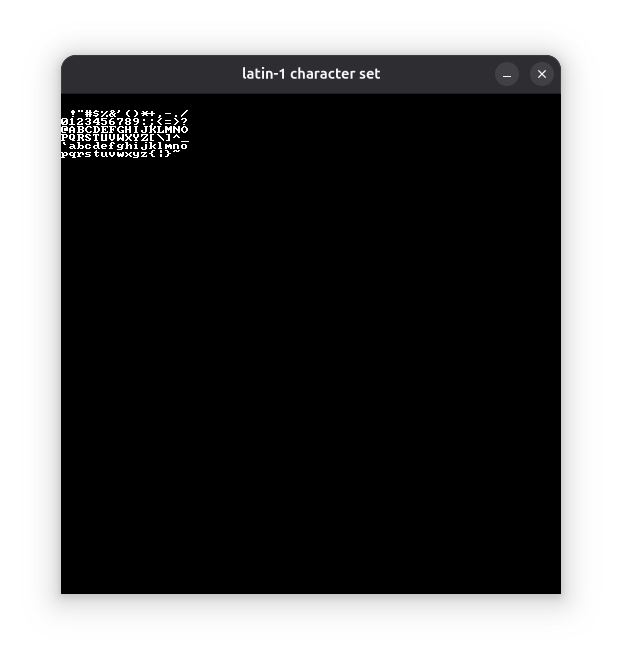

- [ ] Tell context about Pong and the simple way I made score

- [ ] Present the features we want for our text


## The General Approach

The first thing I need is designing an 8x8 bitmap font.

8x8 is pretty convenient, because it means that each character can be nicely represented by eight 8-bit integers.
If we take for example the 'B' character, the rows, from top to bottom, can we encoded this way

- [ ] Show the 'B' character in pixel, then encoded

As such, the 'B' can be:

```c
char B[] = {
    0xFC, // 1st (top-most) row
    0x66, // 2nd row
    0x66, // ...
    0x7C,
    0x66,
    0x66,
    0xFC,
    0x00, // last (bottom) row
};
```

To tell if we draw the pixel at `column`/`row` for character `B`, we perform a bit shift at index `row` of `B`.
Putting this all together, drawing a 'B' will correspond to this code:

```c
// Draw B on 'bitmap' at 'x'/'y'
for(size_t row = 0 ; row < 8 ; ++row) {
    for(size_t column = 0 ; column < 8 ; ++column) {
        if((B[row] >> (7 - column)) & 0x01) {
            write_pixel(bitmap, x + column, y + row, white);
        }
    }
}
```
This draws an unscaled 8x8 pixel character at the given position (`x`/`y`):


Now, this could be simplified first, by horizontally flipping the encoded character.
This way, the bit shift is directly taken from the column:

- [ ] Do like above, but horizontally split

```c
char B[] = { 0x3F, 0x66, 0x66, 0x3E, 0x66, 0x66, 0x3F, 0x00, };

for(size_t row = 0 ; row < 8 ; ++row) {
    for(size_t column = 0 ; column < 8 ; ++column) {
        if((B[row] >> column) & 0x01) {
            write_pixel(bitmap, x + column, y + row, white);
        }
    }
}
```

And of course, we don't want to write a single char, but a text entirely.

## Creating a Font

First, we will stick to the usual Latin-1 characters, and make an entire array of letters (horizontally flipped).
Fortunately, [someone already did it](https://github.com/dhepper/font8x8A), which was a time saver for me:

```c
#define CHAR_PIXEL_H 8
#define CHAR_PIXEL_W 8 // Used later

static char charset_latin1[][CHAR_PIXEL_H] = {
    { 0x00, 0x00, 0x00, 0x00, 0x00, 0x00, 0x00, 0x00},   // U+0000 (nul)
    { 0x00, 0x00, 0x00, 0x00, 0x00, 0x00, 0x00, 0x00},   // U+0001
    // ... Lots of lines ...
    { 0x0C, 0x1E, 0x33, 0x33, 0x3F, 0x33, 0x33, 0x00},   // U+0041 (A)
    { 0x3F, 0x66, 0x66, 0x3E, 0x66, 0x66, 0x3F, 0x00},   // U+0042 (B)
    { 0x3C, 0x66, 0x03, 0x03, 0x03, 0x66, 0x3C, 0x00},   // U+0043 (C)
    { 0x1F, 0x36, 0x66, 0x66, 0x66, 0x36, 0x1F, 0x00},   // U+0044 (D)
    // ... Lots of lines ...
};
```

This table, covers, all letters from [Basic Latin](https://en.wikipedia.org/wiki/List_of_Unicode_characters#Basic_Latin), the first Unicode block.
This will be a good start from simple text rendering.
But most importantly, this also means that, in a first time, I'll be able to directly take the `char` ASCII values from a C-style string, and use it as an index for my array (`charset_latin1['B']`).

Now, let's make a dedicated bitmap to contain all the characters of this table.
First, we want to decide about the dimension of our character bitmap.
It will be an NxM grid, each cell containing the glyph for a character.
I arbitrarily decided that the bitmap will contain rows of 16 characters.
The number of rows itself, will depend on the total number of character to support.
In the case of the `charset_latin1` page I showed above, it's 128 characters.
But I will make this a runtime information in order to support, later on, other pages of characters.

Eventually, we get enough data to create a bitmap to hold our charset:

```c
#define CHARSET_CHAR_PER_ROW 16 // Given at compile-time

// The total number of characters in the page (here, 128)
const size_t charset_char_len     = sizeof charset_latin1 / sizeof charset_latin1[0];

// The number of characters displayed in a column
const size_t charset_char_per_col = 
    charset_char_len / CHARSET_CHAR_PER_ROW 
    + (charset_char_len % CHARSET_CHAR_PER_ROW > 0);

// Dimensions of the charset bitmap
const size_t charset_pixel_width  = CHARSET_CHAR_PER_ROW * CHAR_PIXEL_W;
const size_t charset_pixel_height = charset_char_per_col * CHAR_PIXEL_H;

bitmap* charset create_bitmap(charset_width, charset_height);
```

Another thing we need to get easily, is the X/Y coordinate of a character, given its index in `charset_latin1`.
I make it a function-like macro because I know this will be used in a couple of lines:

```c
#define CHAR_PIXEL_X(c) ((c % CHARSET_CHAR_PER_ROW) * CHAR_PIXEL_W)
#define CHAR_PIXEL_Y(c) ((c / CHARSET_CHAR_PER_ROW) * CHAR_PIXEL_H)
```


```c
for(size_t c = 0 ; c < charset_char_len ; ++c) {
    const size_t x = CHAR_PIXEL_X(c);
    const size_t y = CHAR_PIXEL_Y(c);

    for(size_t row = 0 ; row < CHAR_PIXEL_H ; ++row) {
        for(size_t column = 0 ; column < CHAR_PIXEL_W ; ++column) {
            if((charset_latin1[c][row] >> column) & 0x01) {
                write_pixel(charset, x + column, y + row, white);
            }

        }
    }
}
```

Ok, so we got a bitmap, hopefully correctly filled in.
Let's display it as-in on a screen, and we get:



Looks promising.
Of course the display is tiny, but that's because each character is taking only 8x8 pixels.
But hey, we have a character set in a bitmap, and that's more that enough to start writing text after all.

## Draw a Single Character

Now, displaying text on a bitmap will require something called "blitting".
Blitting is about taking a portion of a bitmap, and copying it into another bitmap, wherever we want.
Blitting is behing most pure 2D sprite-based video games.

While I won't enter into detail about implementing blitting, for it is out of the scope of this post.
Thus, we will consider this small API:

- [ ] Illustrate blitting

```c
typedef struct {
    int x;
    int y;
    unsigned int w;
    unsigned int h;
} area;

blit_bitmap(
    const bitmap* source, const area* source_area,
    bitmap* dest, const area* dest_area
);
```

When this function is called, the `source_area` portion of `source` is copied into the `dest_area` portion of `dest`.
If the two areas don't have the same dimensions, the original portion ends up stretched or squeezed to fit in.

Now, displaying a specific character on screen is about getting the area of the character in the charset and performing a blit where we want in the destination bitmap:

```c
const char c = 'T';

const area char_area = {
    .x = CHAR_PIXEL_X(c), .y = CHAR_PIXEL_Y(c),
    .w = CHAR_PIXEL_W,    .h = CHAR_PIXEL_H,
};

const area dest_area = {
    .x = 100, .y = 100,
    .w = 48,  .h = 48,
};

blit_bitmap(charset, &char_area, p_bitmap, &dest_area);
```

And voilà!
We have a 'T' displayed at 100/100, with a size of 48/48:


## Draw an Entire Text

Let's consider a string to display:

```c
const char* text = "Hello, World!";
```

We want to iterate over our char-by-char drawing, moving at the same time our "carret" on the right.
Let's consider `x` and `y`, the coordinates of the first letter to print and `height`, the character height to print in pixels.
We have enough to determined the area of the destination bitmap that will contain the first letter:

```c
area dest_area = {
    .x = 10,
    .y = 100,
    .w = (float)height / (float)CHAR_PIXEL_H * (float)CHAR_PIXEL_W,
    .h = height,
};
```

The area width could be set to `height`, since of character size is a square 8x8.
But that may not be the case later.
As such, I prefer computing the character width proportionnally to the expected height.

Now, we can iterate through our string and blit each character, the same way we did earlier for a single one:

```c
const size_t len = bj_strlen(text);
for(size_t c = 0 ; c < len ; ++c) {
    const char code = text[c];

    // Determined character sprite to blit
    const bj_rect char_area = {
        .x = CHAR_PIXEL_X(code), .y = CHAR_PIXEL_Y(code),
        .w = CHAR_PIXEL_W,       .h = CHAR_PIXEL_H,
    };

    // Draw character
    blit_bitmap(charset, &char_area, p_bitmap, &dest_area);

    // Advance dest_area horizontally by one character.
    dest_area.x += dest_area.w;
}
```
The full text now displays:


## Going Further

This first approach to printing text is more than enough to provide something usable in my API.
I do see some good improvements though:

- **A better support for Unicode**: Currently, the code only supports letters from the first unicode block, which moreless corresponds to ASCII printables.
  This can be expanded with a better support for others blocks.
  A nice approach could be to have a single bitmap for all pages, but only prepare the blocks when needed first.

- **Colors**: That one will be unavoidable.
  I am storing a bitmap of _white_ characters.
  Blit functions usually have operations, allowing the user to decide how each pixel is affected by the blit, at channel level (red, green, blue, alpha).
  API-side, we could consider sending the color as a parameter to the print function, or use escape codes, like how we color terminals.
  Or maybe both.

- **String format support**: A really handy feature could be to provide the print function through string formatting, the same way standard `printf()` works.

- **Structured output**: For now, we write to the right and there is no control about how the text is displayed.
  If the text is larger than the screen, it is simply cropped.
  Since the font is fixed-width, we can easily obtain any input text geometry.
  Then, instead of printing a text at only X/Y coordinates, the user can provide an area that will contains the printed text.
  A set of options can then be provided to customize how this area is filled in.
  For example horizontal and vertical alignment, font size and text wrapping.


